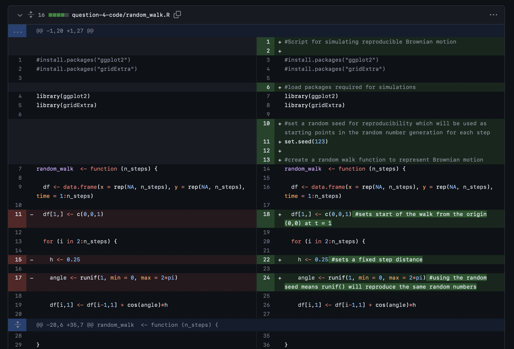
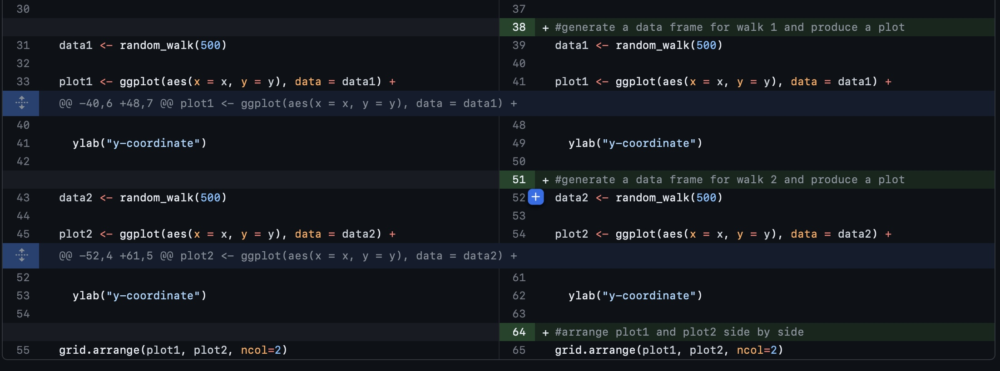

# Reproducible research: version control and R

**link to questions 1, 2 and 3:** https://github.com/p-number-8737/logistic_growth.git 

**Question 4:**
- Two plots are created side by side: plot1 and plot 2, which both visualise one of the random walks created from data1 and data2. The plot colour is a gradient which indicates the progression of time in the walk (progresses from dark to light blue over time). Both walks begin at the origin (0,0) but they form divergent paths by moving a fixed, random distance called 'h' which is set as 0.25 units. Both paths disperse from the origin and move further away over long time periods with more steps. Each of the random walks are different to eachother and the direction of the plotted paths changes randomly at each step making it a non-linear and unpredictable pattern.

- A random seed is used as the starting point in a Pseudorandom Number Generator (PRNG) which produces a sequence of random numbers. It works by initialising PRNG using a specific seed value to start the number generation. The same seed value will produce the same sequence of random numbers from the PRNG. This is important for reproducible random simulations as setting a seed allows the simulation to be run the same way by different researchers. In R scripts you set a seed by using the set.seed() function.

- _path file for reproducible simulation:_ [random_walk.R](question-4-code/random_walk.R)

- 
- 

**Question 5:** link to script I have used to answer [question_5_graph_analysis.R](question_5_graph_analysis.R)
- there are 33 rows, and 13 columns

- apply the logarithic transformation (log()) to the data for V (virion volume) and L (genome length).

- α = 1.5152 (the estimate of Log_L of lm), **p-value** = 6.44e-10
- β = 1181.807 (back-transformed intercept of lm) **p-value** = 2.28e-10
     - both p-values are <0.05 and are statistically significant.
     - I did find approximately the same values as Table 2 (using the 95% CI)
 
- the code to reproduce the figure shown is...
     - library(ggplot2)
     - data <- read.csv("/cloud/project/question-5-data/Cui_etal2014.csv")
     - data <- data[data$Virion.volume..nm.nm.nm. > 0 & data$Genome.length..kb. > 0, ] #this makes sure the plot only inludes values > 0, added as when running the graph originally there were errors of non-finite values (i.e. NAs) which are filtered out
     - data$log_V <- log(data$Virion.volume..nm.nm.nm.)
     - data$log_L <- log(data$Genome.length..kb.)

     - ggplot(data, aes(x = log_L, y = log_V)) + 
        geom_point() +  #this plots the actual data points
        geom_smooth(method = "lm", color = "blue", fill = "grey80") +  #this adds linear regression line with 95% confidence interval
        theme_bw() + 
        xlab("log [Genome length (kb)]") + 
        ylab("log [Virion volume (nm^3)]") + 
        xlim(c(2, 8)) +  #set x-axis limits
        ylim(c(9, 20)) #set y-axis limits

- estimated volume for a 300kb dsDNA virus = 6697006 nm3

**Bonus Question**
- _Reproducibility_is the capacity for other researchers to recreate the analysis and results of research by using the sama dataframes and methodology. This refers to the consistency of results across different researchers.
- _Replicability_is conducting the research again and analysing the new data using the orginal methodology to identify if similar results are reached. This refers to the consistency of results across different experiments.
  
- GitHub can enhance these through:
     - Version control which tracks changes made to code using dev and main branches. This means mistakes can be reverted.
     - Collaboration with multiple people working simultaneously, merging changes to update scripts and resolving conflicts.
     - Transparency of scripts allows other researchers to reuse and validate the code which improves reproducibility.
 
- Limitations of GitHub are...
     - Not all data can be shared publicly which limits data analysis collaboration
     - Some analysis may need high computational resources which cannot be easily replicated.
     - It can take a long time to learn how to effectively use GitHub which may lead to poorer quality/ lost work.

       
## Instructions

The homework for this Computer skills practical is divided into 5 questions for a total of 100 points (plus an optional bonus question worth 10 extra points). First, fork this repo and make sure your fork is made **Public** for marking. Answers should be added to the # INSERT ANSWERS HERE # section above in the **README.md** file of your forked repository.

Questions 1, 2 and 3 should be answered in the **README.md** file of the `logistic_growth` repo that you forked during the practical. To answer those questions here, simply include a link to your logistic_growth repo.

**Submission**: Please submit a single **PDF** file with your candidate number (and no other identifying information), and a link to your fork of the `reproducible-research_homework` repo with the completed answers. All answers should be on the `main` branch.

## Assignment questions 

1) (**10 points**) Annotate the **README.md** file in your `logistic_growth` repo with more detailed information about the analysis. Add a section on the results and include the estimates for $N_0$, $r$ and $K$ (mention which *.csv file you used).
   
2) (**10 points**) Use your estimates of $N_0$ and $r$ to calculate the population size at $t$ = 4980 min, assuming that the population grows exponentially. How does it compare to the population size predicted under logistic growth? 

3) (**20 points**) Add an R script to your repository that makes a graph comparing the exponential and logistic growth curves (using the same parameter estimates you found). Upload this graph to your repo and include it in the **README.md** file so it can be viewed in the repo homepage.
   
4) (**30 points**) Sometimes we are interested in modelling a process that involves randomness. A good example is Brownian motion. We will explore how to simulate a random process in a way that it is reproducible:

   - A script for simulating a random_walk is provided in the `question-4-code` folder of this repo. Execute the code to produce the paths of two random walks. What do you observe? (10 points)
   - Investigate the term **random seeds**. What is a random seed and how does it work? (5 points)
   - Edit the script to make a reproducible simulation of Brownian motion. Commit the file and push it to your forked `reproducible-research_homework` repo. (10 points)
   - Go to your commit history and click on the latest commit. Show the edit you made to the code in the comparison view (add this image to the **README.md** of the fork). (5 points)

5) (**30 points**) In 2014, Cui, Schlub and Holmes published an article in the *Journal of Virology* (doi: https://doi.org/10.1128/jvi.00362-14) showing that the size of viral particles, more specifically their volume, could be predicted from their genome size (length). They found that this relationship can be modelled using an allometric equation of the form **$`V = \beta L^{\alpha}`$**, where $`V`$ is the virion volume in nm3 and $`L`$ is the genome length in nucleotides.

   - Import the data for double-stranded DNA (dsDNA) viruses taken from the Supplementary Materials of the original paper into Posit Cloud (the csv file is in the `question-5-data` folder). How many rows and columns does the table have? (3 points)
   - What transformation can you use to fit a linear model to the data? Apply the transformation. (3 points)
   - Find the exponent ($\alpha$) and scaling factor ($\beta$) of the allometric law for dsDNA viruses and write the p-values from the model you obtained, are they statistically significant? Compare the values you found to those shown in **Table 2** of the paper, did you find the same values? (10 points)
   - Write the code to reproduce the figure shown below. (10 points)

  

     
  

  - What is the estimated volume of a 300 kb dsDNA virus? (4 points)

**Bonus** (**10 points**) Explain the difference between reproducibility and replicability in scientific research. How can git and GitHub be used to enhance the reproducibility and replicability of your work? what limitations do they have? (e.g. check the platform [protocols.io](https://www.protocols.io/)).
